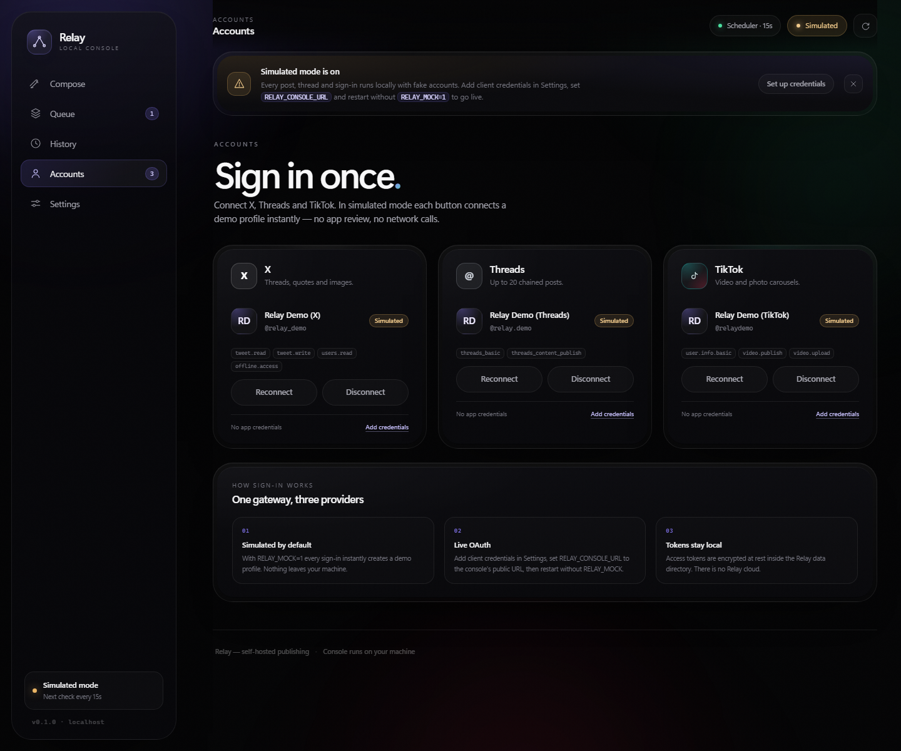

# Relay

**Self-hosted publishing for X, Threads and TikTok — with an MCP server and a local console.**

Relay is a small, local-first alternative to tools like Metricool, focused on one job: **posting**.
It gives you a browser console for composing and scheduling, plus an MCP server so an AI agent
(Claude, Codex, DeepSeek Harness, …) can sign in accounts and publish across all three networks.

No accounts, no cloud, no database server. State lives in `.data/`, tokens are encrypted at rest,
and everything runs in **simulated mode** until you add developer credentials for a platform —
so you can try the whole product immediately.




```text
┌──────────────┐   MCP (stdio)   ┌────────────────────────────┐   OAuth + REST   ┌─────────┐
│ MCP client   │ ───────────────▶│  Relay MCP server          │ ───────────────▶ │ X       │
│ (agent)      │                 │  apps/mcp                  │                  ├─────────┤
└──────────────┘                 │            └── core service│ ───────────────▶ │ Threads │
┌──────────────┐   HTTP          │  Relay console             │                  ├─────────┤
│ Browser      │ ───────────────▶│  apps/web                  │ ───────────────▶ │ TikTok  │
└──────────────┘                 └────────────────────────────┘                  └─────────┘
                                        shared encrypted state in .data/
```

## What you get

- **Full posting, not just text** — images, video, multi-part threads/chains, quote posts,
  TikTok photo carousels, per-platform options, character-limit validation before anything is sent.
- **One-click sign-in** — connect X, Threads and TikTok from the console; Relay runs the OAuth
  flow locally and stores the tokens encrypted. The MCP server can start the same flow with `relay_connect`.
- **Scheduling and a queue** — pick a date/time and Relay publishes it. A PID lock guarantees only
  one running Relay process fires scheduled posts, even if the console and MCP server share `.data/`.
- **Simulated mode by default** — no credentials required. Every account is connected and every
  post is simulated (`mode: "mock"`), so the UI, MCP tools and scheduler can be tested end to end.
- **MCP-native** — 10 tools for account management, validation, posting, scheduling, history and limits.
- **Local and private** — binds `127.0.0.1`, optional console password, AES-256-GCM token storage,
  no telemetry.
- **Posting only, by design** — no analytics or inbox. Just the composer, queue and history.

## Requirements

- Node.js **22.18+** (tested on Node 24.13, Windows 11; macOS/Linux should work)
- A browser for the console
- Optional, only for real posts: developer apps for [X](https://developer.x.com),
  [Threads](https://developers.facebook.com) and/or [TikTok](https://developers.tiktok.com)

## Quickstart

**Windows — no terminal needed (recommended):**

1. Open **Start** and type `Relay`, or double-click the **Relay** icon on your Desktop.
2. The Relay window starts the server, opens the console at <http://127.0.0.1:4317> and keeps
   running in the tray.
3. To stop everything: right-click the tray icon → **Exit**, or use **Stop Relay** in the Start
   Menu.


`Relay.exe` lives in [`tools/RelayApp/`](tools/RelayApp) and is built from
[`RelayApp.cs`](tools/RelayApp/RelayApp.cs) with [`build.ps1`](tools/RelayApp/build.ps1)
(recompiles the exe and recreates the Desktop + Start Menu shortcuts). The terminal launcher
`start-relay.cmd` still exists as a fallback.

**Any OS, from a terminal — run the commands *inside the repo folder*:**

```bash
cd C:\Users\User\Documents\deepseek-harness\default-workspace   # PowerShell
npm install
npm run start
```

> npm resolves `package.json` from the **current directory**. Running `npm install` from
> `C:\Users\User` fails with `ENOENT ... C:\Users\User\package.json` — that means you are in the
> wrong folder, not that the project is broken. Running the app from the wrong folder also leaves
> nothing listening on port 4317, so the browser shows `ERR_CONNECTION_REFUSED`.

Then open **http://127.0.0.1:4317**.

1. Go to **Accounts** and click **Sign in with X / Threads / TikTok** — in simulated mode the
   account is connected instantly (no OAuth round-trip).
2. Compose a post, pick platforms, optionally attach media or add thread parts.
3. Publish now, or choose a date/time to queue it. Watch it in **Queue** and **History**.

Generated files live in `.data/` (git-ignored):

```text
.data/
├── db.json               # accounts (encrypted secrets), queue, history
├── secret.key            # AES-256-GCM key for tokens and client secrets
├── credentials.enc.json  # client id/secret saved from the console (encrypted)
├── media/                # files uploaded from the composer
└── scheduler.lock        # PID of the process currently publishing scheduled posts
```

`npm run start` builds every workspace and runs the console (which also owns the scheduler).

### Configuration

Copy `.env.example` to `.env`. The apps read these variables automatically:

| Variable | Default | Purpose |
| --- | --- | --- |
| `RELAY_DATA_DIR` | `<repo>/.data` | State directory |
| `RELAY_HOST` / `RELAY_PORT` | `127.0.0.1` / `4317` | Console bind address |
| `RELAY_CONSOLE_URL` | `http://127.0.0.1:4317` | Public console URL used for OAuth callbacks |
| `RELAY_CONSOLE_PASSWORD` | unset | Optional password for the console |
| `RELAY_MOCK` | unset | `1` forces simulated mode for every platform |
| `RELAY_PUBLIC_MEDIA_BASE_URL` | unset | Tunnel URL that serves `.data/media` (needed for live Threads/TikTok photos) |
| `X_CLIENT_ID`, `X_CLIENT_SECRET` | unset | X OAuth 2.0 app |
| `THREADS_CLIENT_ID`, `THREADS_CLIENT_SECRET` | unset | Threads app |
| `THREADS_AUTOREPLY_ENABLED` | `true` | Local Threads auto-reply toggle (also a persisted Settings flag) |
| `DEEPSEEK_API_KEY` | unset | DeepSeek key for auto-reply; without it comments are logged and skipped |
| `TIKTOK_CLIENT_KEY`, `TIKTOK_CLIENT_SECRET` | unset | TikTok app |

You can also paste the same credentials in **Settings → Platform credentials**; they are saved
encrypted in `.data/credentials.enc.json`. Environment variables win only when a field is not set
in Settings.

### Local Threads auto-reply

When auto-reply is on (default), publishing a Threads post or discovering a new own post from
`/me/threads` opens a persisted 30-minute window. Every ~2 minutes Relay reads that post's
conversation and classifies each new comment. Spam and hostile comments are flagged without a
reply; genuine comments get one short, balanced reply in the commenter's language, written by
DeepSeek (`deepseek-chat`). Comment ids that were replied to or flagged are persisted, so a restart
never replies twice. The hard stop is checked immediately before every post: nothing is posted
after `publishedAt + 30 minutes`, and a missing `threads_read_replies` /
`threads_manage_replies` scope stops the window.

Read the log at `GET /api/threads/autoreply/log` (`{replies, flagged, windows}`) or with the
`relay_threads_autoreply` MCP tool. Toggle the persisted settings flag with
`POST /api/threads/autoreply` and `{"enabled": false}`. If `DEEPSEEK_API_KEY` is missing Relay logs
the skip and posts nothing — there is no fallback reply.

### Comments beyond Threads (`relay_comments_new`, `relay_reply`)

Built for a bot that wakes up on a schedule (Comment Reply Manager). The Relay side is plain code with no LLM: it fetches, de-duplicates and sorts comments, and the bot only spends effort on the ones that need a real answer.

**`relay_comments_new`** (`platform` = `threads` | `instagram` | `youtube` | `all`, default `all`; `since_hours` 1-168, default 48; `limit` 1-100, default 20; `mark_seen` default `true`) returns only comments on your own posts that were not handed out before:
`{platform, post_id, comment_id, author, text, created_at, post_caption_snippet, kind}`. `kind` comes from a code pre-filter:

- `spam`: links, phone numbers, long repeated characters or words, many @mentions, known spam phrases. Flagged, never needs a reply (`spam_reason` says why).
- `simple`: emoji only, "thanks", "nice", "ok", "tq bos", "mantap" and similar in English and Malay. Comes with a `suggested_template` (short Malay or Manglish thank-you, rotated, no emoji, no em dashes).
- `needs_reply`: everything else, including anything with a question mark.

With `mark_seen: true` the returned ids are written to the JSON store (`.data/comments.json`, a separate file so older Relay processes that are still running cannot wipe it), so each comment comes back once, even after a restart. `mark_seen: false` is a read-only peek. If more than `limit` comments are waiting, the rest stay unseen and `more_available` is `true`. `platforms[]` reports per platform `ok`, `not_connected`, `needs_reconnect` (the stored token lacks the comment scope, message says "needs reconnect for comments") or `error`; one platform failing never breaks the others. `relay_accounts` also shows a `comments` readiness block.

**`relay_reply`** (`platform`, `comment_id`, `text`, optional `post_id`, optional `dry_run`) posts one reply: Threads (existing reply code), Instagram `POST /{comment-id}/replies`, YouTube `comments.insert` with `parentId`. Length limits: Threads 500, Instagram 2200, YouTube 10000. A comment id is never answered twice (replied ids are stored, and the Threads auto-reply log counts too); a repeat returns `comment_already_replied`. `dry_run: true` checks everything and sends nothing. Soft `warnings` flag an em dash or a disclaimer in the text.

Reconnect needed once, so the new scopes are granted:

- Instagram: `instagram_business_manage_comments` (the Meta app must have this permission added; Standard Access is enough for your own account, no App Review).
- YouTube: `https://www.googleapis.com/auth/youtube.force-ssl` (add it to the OAuth consent screen scopes).
- Threads already has `threads_read_replies` and `threads_manage_replies`.

How little it does per poll:

| Platform | Calls per poll | Cost |
|---|---|---|
| Threads | 1 post list + 1 conversation per post in the window | Graph API, no quota |
| Instagram | 1 media list + 1 comments call per post in the window that has comments | Graph API, no quota |
| YouTube | 1 `commentThreads.list` (whole channel, newest first, 2 pages max) + 1 `videos.list` for titles | 2 to 3 units per poll |

YouTube quota (10,000 units per day by default): a poll every 10 minutes is about 300 to 450 units a day, a reply (`comments.insert`) is 50 units, so roughly 150 replies a day still fit next to it. An upload costs 1,600. Quota resets at midnight Pacific Time.

Comments are read for posts published inside `since_hours` (YouTube: any video, newest comments first). The built-in Threads auto-reply (off in the supervisor setup) keeps its own 30-minute window; while it is on, `relay_comments_new` holds back posts whose window is still open so a comment is never answered twice.

## MCP server

Build once with `npm run build`, then point any MCP client at the stdio server:

```json
{
  "mcpServers": {
    "relay": {
      "command": "node",
      "args": [
        "C:\\path\\to\\relay\\apps\\mcp\\dist\\index.js",
        "--console-url",
        "http://127.0.0.1:4317"
      ]
    }
  }
}
```

Use absolute paths for `args`; add `"--mock"` to force simulation, or set `RELAY_DATA_DIR`,
`RELAY_MOCK=1` and `RELAY_CONSOLE_URL` through the client's `env` block.

| Tool | What it does |
| --- | --- |
| `relay_accounts` | Connected accounts, live/simulated state, next step |
| `relay_connect` | Start sign-in for a platform (instant in simulated mode) |
| `relay_disconnect` | Remove a connected account |
| `relay_post` | Validate + publish or schedule a post (text, media, threads, options) |
| `relay_validate` | Dry run: limits and issues without publishing |
| `relay_queue` | List scheduled jobs and their status |
| `relay_cancel` | Cancel a pending scheduled job |
| `relay_article_validate` | Dry-run check of an X Article (nothing is created) |
| `relay_article` | Publish or schedule an X Article (long-form post) |
| `relay_delete` | Remove a queued job, or delete published posts on X and Threads (needs `confirm`) |
| `relay_history` | Published/simulated results |
| `relay_threads_comments` | Read-only recent Threads posts and their comments |
| `relay_threads_autoreply` | Read-only log of local auto-replies, flagged comments and windows |
| `relay_threads_reply` | Explicitly reply to one Threads comment (never automatic) |
| `relay_limits` | Per-platform character/media limits and requirements |
| `relay_console` | Console URL, data dir, credential state and client config |

Example prompts:

> "Connect my X account, then post 'Shipping day 🚀' and schedule the same text for Threads at 9am tomorrow."

> "Draft a three-part thread about our new feature, validate it for X and Threads, and publish it everywhere."

> "What can I post where? Show me the limits and which accounts are connected."

**Live sign-in needs the console running**: `relay_connect` returns an OAuth URL whose callback is
served by the console at `RELAY_CONSOLE_URL` (`/auth/callback/<platform>`). When the account is not
in simulated mode, the MCP server also opens that URL in your default browser. Start the console
first (open the **Relay** app), then ask Claude to connect the account.

### Connect to Claude

**Claude Desktop** — add Relay to `%APPDATA%\Claude\claude_desktop_config.json` (this machine is
already configured), then fully quit Claude from the tray and reopen it:

```json
{
  "mcpServers": {
    "relay": {
      "command": "C:\\Program Files\\nodejs\\node.exe",
      "args": [
        "C:\\Users\\User\\Documents\\deepseek-harness\\default-workspace\\apps\\mcp\\dist\\index.js",
        "--data-dir",
        "C:\\Users\\User\\Documents\\deepseek-harness\\default-workspace\\.data",
        "--console-url",
        "http://127.0.0.1:4317"
      ]
    }
  }
}
```

**Claude Code** — one command (user scope means it works in every project):

```powershell
claude mcp add --scope user relay -- "C:\Program Files\nodejs\node.exe" `
  "C:\Users\User\Documents\deepseek-harness\default-workspace\apps\mcp\dist\index.js" `
  --data-dir "C:\Users\User\Documents\deepseek-harness\default-workspace\.data" `
  --console-url "http://127.0.0.1:4317"
claude mcp list        # relay should show "Connected"
```

Run `npm run build` once before connecting (the config points at `apps/mcp/dist/index.js`).
Full setup, verification and troubleshooting: [`docs/CLAUDE.md`](docs/CLAUDE.md).

## Going live (real posting)

1. Start the console and click **Settings** (or copy `.env.example` → `.env`).
2. Create a developer app per platform and add the redirect URI shown in Settings.
3. Paste client id + secret into Settings, or set the env vars, then restart Relay.
4. Sign out and sign back in to each platform — the account flips from **Simulated** to **Live**.
5. Media rules for live posts:
   - **X** uploads files directly.
   - **Threads** fetches media from a **public URL**. Point a tunnel (ngrok, cloudflared) at the
     console and set `RELAY_PUBLIC_MEDIA_BASE_URL`, or pass media `url` values.
   - **TikTok** uploads videos directly; photo carousels need public URLs. Apps that have not
     passed TikTok's audit can only post privately — set the post's `tiktokPrivacy`/`selfOnly` option
     to `SELF_ONLY`.

See [`docs/CONNECT-ACCOUNTS.md`](docs/CONNECT-ACCOUNTS.md) for a click-by-click setup guide
(developer portal links, exact redirect URIs and scopes) and [`docs/GOING-LIVE.md`](docs/GOING-LIVE.md)
for provider-specific details and caveats.

## Posting capabilities and limits

| | X | Threads | TikTok |
| --- | --- | --- | --- |
| Text per part | 280 | 500 | 2,200 (caption) |
| Parts per post | 25 (thread) | 20 (chain) | 1 |
| Media per post | 4 images / 1 video | 1 item or a 2–20 item carousel | 35 photos / 1 video |
| Text-only posts | ✅ | ✅ | ❌ (media required) |
| Video upload | direct | public URL | direct |
| Image upload | direct | public URL | public URL (photo mode) |
| Replies / quote | reply chains, quote post | reply chains | — |
| Privacy / reply controls | reply settings | reply controls | `PUBLIC_TO_EVERYONE` / `MUTUAL_FOLLOW_FRIENDS` / `SELF_ONLY` |
| Thread/chain parts | 25 | 20 | — |

Threads parts can carry a single image/video or a carousel of 2–20 images and/or videos (public
URLs required). Attach media per thread part if you want several carousels across a chain.

Validation runs before publishing: over-limit text, too many parts, missing/oversized media,
unsupported types and unreachable files are reported per platform, and nothing is published unless
every target passes (a scheduled job that fails validation is marked `failed` in the queue).

### Threads: reply under an existing post

Threads chains always reply to the **published** media id returned by
`/threads_publish` (never a container or carousel-child id). Every container,
including text replies, is polled (`GET /{container-id}?fields=status,error_message`)
until `FINISHED` before it is published, the relay waits
`RELAY_THREADS_REPLY_SETTLE_MS` (default 3000) before creating each reply, and
Meta's "media not found" error (code 24 / subcode 4279009) is retried with
exponential backoff (`RELAY_THREADS_NOT_FOUND_RETRIES`, default 4;
`RELAY_THREADS_NOT_FOUND_BACKOFF_MS`, default 2000). Each container id,
`reply_to_id` and published id is written to the console log with a `[threads]` prefix.

To add parts under a post that is already live, pass its published id as
`replyToId` (alias `parentPostId`) on `POST /api/posts`, or as
`options.threads.replyToId` (also accepted by the MCP publish tool). Part 1
replies to that post, part 2 replies to part 1, and so on. The id must be numeric;
other platforms (except X, below) reject the option.

```json
POST /api/posts
{
  "platforms": ["threads"],
  "replyToId": "18133692964708115",
  "thread": [
    { "text": "Part 2 ..." },
    { "text": "Part 3 ..." }
  ]
}
```
### Replying to an X post

`replyToId` also works on X. Pass the numeric id of an existing published X
post and the post (or part 1 of a thread) is sent with
`reply.in_reply_to_tweet_id` set to it; later thread parts chain after part 1 as
usual. It works with `relay_validate` (reports problems, posts nothing) and with
`schedule_at` (the queued job keeps `replyToId`).

```json
relay_post { "platforms": ["x"], "text": "...", "replyToId": "1234567890123456789", "schedule_at": "2026-10-26T09:00:00+08:00" }
```

Rules: the id must be digits only; it cannot be combined with `quotePostId`;
tiktok, youtube and instagram reject it. `replyToId` at draft level is a
shorthand for a single X or Threads target. A draft that targets both X and
Threads must use `options.x.replyToId` and `options.threads.replyToId`, because
the two platforms use different post ids. X may refuse a reply to an account that
did not mention or engage with you first (an X API rule, not a Relay one).

### X Articles (`relay_article`)

Relay can publish X Articles (long-form posts) through the official X API v2:
`POST /2/articles/draft` creates the draft, then `POST /2/articles/{id}/publish`
publishes it. Both calls use the `tweet.write` scope (a cover image also needs
`media.write`; both are already in the X scope list). The X account must be
allowed to write Articles (Premium).

Tools:

- `relay_article_validate`: dry run. Checks title, body, cover, `schedule_at`, the
  X connection and the granted scopes. Creates nothing on X.
- `relay_article`: validates, then publishes now, or queues when `schedule_at` is
  in the future. X has no native Article scheduling, so a queued article does not
  exist on X until Relay creates and publishes it at the scheduled time.

Fields (same for both tools):

| Field | Type | Notes |
| --- | --- | --- |
| `title` | string | 1-100 characters. |
| `body` | `[{ heading?: string, paragraphs?: string[], image?: { path, altText?, caption? } }]` | Sections, in order. A heading becomes a level-2 heading. An image sits after that section's heading and paragraphs; to put one between two paragraphs give it its own item (see below). Use this or `body_markdown`. |
| `body_markdown` | string | `#` `##` `###` headings, `> ` quote, `- ` bullets, `1. ` numbers, blank line between paragraphs, and `` on its own line for an inline image. Inline text formatting is not applied. |
| `cover` | `{ path: string, altText?: string }` | Optional. Local JPEG, PNG or WebP, up to 5 MB. A URL alone is not enough because X takes the file upload. |
| `schedule_at` | ISO-8601 string | For example `2026-10-27T09:00:00+08:00`. |
| `force` | boolean | `relay_article` only. Skips the duplicate guard. |

Queued articles appear in `relay_queue` (`kind: "article"`), published ones in
`relay_history` (`kind: "article"`, with the `article` input kept). The same
article is refused when it is already queued or was published in the last 30
minutes unless `force` is true. If publishing fails after the draft was created,
the error names the draft id; the draft stays in the X drafts.

#### Inline body images

Images can sit between paragraphs, not only as the cover. Two forms, same result:

```json
{
  "title": "My article",
  "body": [
    { "paragraphs": ["Paragraph 1.", "Paragraph 2.", "Paragraph 3."] },
    { "image": { "path": "C:\\Users\\User\\pics\\flow.png", "caption": "Optional caption" } },
    { "paragraphs": ["Paragraph 4."] }
  ]
}
```

```text
Paragraph 3.


Paragraph 4.
```

Markdown forms: ``, ``, and ``.
The text in brackets is the alt text; a caption is only shown when you give one.

- Local file path required (X uploads the file): JPEG, PNG or WebP, up to 5 MB each,
  at most 10 images per article. A URL alone is rejected.
- `relay_article_validate` checks every file (exists, type, size) and returns
  `stats.images` and `stats.imageFiles` (path, type, bytes, width, height). It uploads nothing.
- `relay_article` uploads the cover and each inline image first, then creates one draft.
  Each image becomes a DraftJS atomic block (text is one space) with an `image` entity
  (`media_items: [{ media_category: "tweet_image", media_id }]`, optional `caption`).
  If any upload or the draft call fails, nothing is published and the error says which
  step failed (for example "Inline image 2 upload (path) failed: ...").
- Issue codes: `article_image_path_required`, `article_image_unreadable`,
  `article_image_type_unsupported`, `article_image_type_unknown`, `article_image_empty`,
  `article_image_too_large`, `article_too_many_images`.
- The X Article format has no alt-text field, so `altText` is kept by Relay but not sent to X.
- Inline images need the `media.write` scope, like the cover.

Limits that Relay enforces itself are conservative guesses, not published X
numbers: title 100 characters, body 100,000 characters, 2,000 blocks, 10 inline images.

Example:

```json
{
  "title": "Why I track ETFs",
  "body": [
    { "heading": "The setup", "paragraphs": ["First paragraph.", "Second paragraph."] },
    { "paragraphs": ["A closing paragraph."] }
  ],
  "cover": { "path": "C:\\Users\\User\\duitpoket\\cover.png" },
  "schedule_at": "2026-10-27T09:00:00+08:00"
}
```

### Deleting posts (`relay_delete`)

Three ways, exactly one per call:

- `job_id`: removes a pending (or canceled/failed) job from the Relay queue.
  Nothing is touched on any platform. Running and done jobs are refused.
- `platform` + `post_id`: deletes one published post.
- `record_id`: deletes every published part of a `relay_history` record, for
  example a whole X thread.

Published deletes need `confirm: true`. Without it the tool only previews the
list. Deleted ids are written to the history record (`results[].deletions`).

Support:

| Platform | Delete |
| --- | --- |
| X | Yes, `DELETE /2/tweets/{id}` (`tweet.write`). |
| Threads | Yes, `DELETE /{media-id}`. Needs the `threads_delete` permission: enable it on the Meta app, set `THREADS_REQUEST_DELETE_SCOPE=1`, restart Relay and reconnect Threads. Without it the tool returns `threads_scope_missing` before calling Meta. Replies under the post are not deleted with it. |
| TikTok, Instagram, YouTube | Returns `unsupported` with the reason. |

Pinning a post is not built: the X API v2 has no endpoint for pinning a post
(only pinned Lists).

## Architecture

```text
packages/core        Types, validation, encrypted JSON store, scheduler lock, RelayService
packages/platforms   Platform adapters (X, Threads, TikTok), mock mode, createRelay() factory
apps/mcp             MCP stdio server exposing posting tools
apps/web             Local HTTP console + single-page UI
tests/               Unit + end-to-end tests (node:test)
```

Both apps call the same `RelayService`, so the console and the MCP server share accounts, queue and
history. The scheduler lock makes exactly one process responsible for publishing scheduled jobs.

## Development

```bash
npm run build       # compile all workspaces
npm run typecheck   # tsc --noEmit per workspace
npm test            # node --test tests/
npm run smoke       # build + end-to-end posting smoke test
npm run mcp         # build + run the MCP server in a terminal
```

## Security notes

- The console binds to `127.0.0.1` by default. Set `RELAY_CONSOLE_PASSWORD` if you expose it.
- OAuth tokens and saved client secrets are encrypted with AES-256-GCM; the key is
  `.data/secret.key`. Lose that file and tokens must be re-connected. The data directory is
  git-ignored — back it up privately.
- OAuth state and PKCE verifiers are single-use and expire after 15 minutes.
- This is a single-user local tool. Do not run it as a multi-tenant service without adding
  proper auth, rate limiting and per-user data separation.

## Always-on supervisor

Relay can run like a background app. The supervisor keeps the console, HTTP MCP endpoint, tunnels and tray app alive, and restarts anything that stops.

```powershell
.\tools\install-relay-autostart.ps1
```

Status:

```powershell
Get-Content .data\relay-supervisor.json
```

See [docs/ALWAYS-ON.md](docs/ALWAYS-ON.md) for details.

## Known limitations

- Simulated mode is the default; live posting requires your own developer app credentials.
- Live API calls follow each provider's current documented endpoints. Provider APIs change and
  some endpoints (notably X media upload) are tier- or version-sensitive — check your developer
  portal if a live call fails.
- Threads and TikTok photo posts need publicly reachable media; a local file path alone is not enough.
- No analytics, inbox, or approval workflows (intentionally post-only).
- TikTok public posting requires an audited app; unaudited apps are limited to private posts.

## License

MIT

## Public media (Instagram, Threads, TikTok photos)

Relay serves one folder publicly at `https://relay.duitpoket.fun/media/<file>`: `C:\Users\User\relay-media` (set by `RELAY_MEDIA_DIR` in `tools/relay-supervisor.ps1`; default is `.data/media`). Only jpg, jpeg, png, webp, mp4, mov, no listing, no sub-folders. Pass the local path (for example `C:\Users\User\relay-media\pic.jpg`) as media and Relay builds the URL (needs `RELAY_PUBLIC_MEDIA_BASE_URL`, which the supervisor sets). Instagram needs JPEG.
